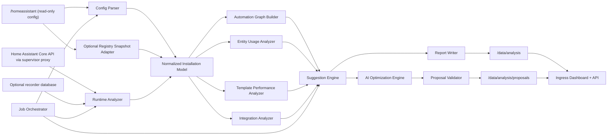

# Home Assistant AI Analyzer Architecture Concept

## Why This Document Exists

This document defines the target architecture for a Home Assistant Add-on named `Home Assistant AI Analyzer`.

It is intentionally written before implementation so that design decisions, safety boundaries, data flow, and extensibility are clear early. The main goal is to reduce implementation risk and make the future system understandable for operators and contributors.

## Debugging Mindset For Future Implementation

When implementation begins, the system should be debuggable in a predictable way:

- each scan run gets a unique `run_id`
- every analysis phase writes logs with that `run_id`
- generated reports are stored in `/data/analysis`
- every finding points back to evidence such as files, entities, or API responses

## Assumptions

- The add-on runs as a Home Assistant Supervisor add-on.
- The Home Assistant configuration directory is mounted read-only inside the container.
- Runtime API access is available through the Supervisor proxy and `SUPERVISOR_TOKEN`.
- Recorder access is optional and must remain read-only.
- AI usage is optional and must be explicitly enabled by the operator.
- v1 does not write back into `/homeassistant`.

## 1. System Overview

The system should analyze a Home Assistant installation from three angles:

1. Static configuration analysis
2. Runtime and API-based analysis
3. People and geolocation behavior analysis
4. Optional AI-assisted optimization proposal generation

To keep the architecture understandable and testable, the add-on should use a layered model:

- **Acquisition layer**: collects YAML files, runtime data, and optional recorder data
- **Normalization layer**: transforms all sources into one internal installation model
- **Analysis layer**: runs specialized analyzers over the normalized model
- **Recommendation layer**: turns findings into ranked suggestions
- **Presentation layer**: stores reports and optionally shows them in a small web dashboard

### Main Architectural Principle

The most important architectural decision is to build a shared `Normalized Installation Model`.

Why this exists:

- each analyzer should work from the same facts
- AI prompts should not assemble ad-hoc data from raw files
- findings should be explainable and reproducible
- testing becomes much simpler when analyzers receive a stable internal structure

### Core Scan Modes

- **Quick Scan**: static config only
- **Full Scan**: static config plus Home Assistant REST/runtime API
- **Deep Scan**: Full Scan plus optional recorder database and optional AI proposals

## 2. Architecture Diagram



## 3. Module Descriptions

### 3.1 Job Orchestrator

Why this exists:

The add-on needs one component that controls scan lifecycle, progress, timing, and result publication. Without this, the analysis modules become tightly coupled.

What happens here:

- create a new `run_id`
- read add-on options
- choose scan mode
- schedule analysis phases
- collect timing information
- handle cancellation, retries, and partial failures

Important invariants:

- a failed analyzer should not destroy earlier results
- partial output should still be persisted when safe
- each phase should declare inputs and outputs explicitly

### 3.2 Config Parser

Why this exists:

Home Assistant configuration can be split across many YAML files and include mechanisms. The parser must resolve these into a source-aware internal model.

What happens here:

- parse `configuration.yaml`
- resolve includes such as `!include`, `!include_dir_merge_list`, and related patterns
- parse `automations.yaml`, `scripts.yaml`, `blueprints/`, and `packages/`
- preserve file paths and line context where possible

Recommended implementation direction:

- use `ruamel.yaml` to preserve line numbers and ordering
- normalize all automations and scripts into typed Python models

Example input and output:

Input:

```yaml
- id: kitchen_motion_lights
  alias: Kitchen Motion Lights
  triggers:
    - trigger: state
      entity_id: binary_sensor.kitchen_motion
      to: "on"
  actions:
    - action: light.turn_on
      target:
        entity_id: light.kitchen
```

Output conceptually:

```json
{
  "type": "automation",
  "id": "kitchen_motion_lights",
  "source_file": "automations.yaml",
  "triggers": ["binary_sensor.kitchen_motion"],
  "actions": ["light.turn_on -> light.kitchen"]
}
```

### 3.3 Optional Registry Snapshot Adapter

Why this exists:

Some useful relationships are not obvious from YAML alone. Entity, device, and integration metadata may be available through Home Assistant runtime registries.

What happens here:

- load optional registry snapshots
- enrich entities with device and integration metadata
- mark this data as optional and version-sensitive

Design caution:

The `.storage` format is not a stable public API. This adapter should stay isolated so the core system still works without it.

### 3.4 Automation Graph Builder

Why this exists:

Simple lists of automations are hard to reason about when many entities, triggers, and scripts interact. A graph makes hidden coupling visible.

What happens here:

- create typed nodes for automations, scripts, entities, services, triggers, conditions, templates, and integrations
- create typed edges such as `listens_to`, `reads`, `writes`, `calls`, and `depends_on`
- export graph data for both analysis and UI visualization

Typical questions this module should answer:

- which entities trigger the largest number of automations
- which scripts are reused heavily
- which automations depend on missing or noisy entities
- where loops or brittle chains may exist

### 3.5 Entity Usage Analyzer

Why this exists:

Home Assistant installations often grow over time. Entities remain after experiments, integration changes, or device removal.

What happens here:

- detect entities referenced in config but missing at runtime
- detect entities present at runtime but barely used
- detect entities with very high change frequency
- detect entities with unusually high downstream automation fan-out

Important caveat:

An entity with no automation references is not automatically unused. It may still be used in dashboards, voice flows, or manual operations. Findings must therefore include confidence, not only binary labels.

### 3.6 Template Performance Analyzer

Why this exists:

Template performance problems are a common hidden cause of unnecessary reevaluation and system load.

What happens here:

- inspect Jinja templates statically
- detect patterns such as global state iteration, `now()`, repeated `state_attr()` calls, wide domain scans, nested loops, and regex-heavy logic
- suggest trigger-based templates when dependencies are explicit

Example pattern:

```jinja2
{{ states.sensor | selectattr('state', 'eq', 'on') | list | count }}
```

Why it is expensive:

- it scans an entire domain repeatedly
- it may re-evaluate often
- it is harder to reason about than a trigger-based alternative with known source entities

### 3.7 Integration Analyzer

Why this exists:

Configuration quality is not only about automations. Integrations can create unnecessary polling, noise, and recorder load.

What happens here:

- determine configured integrations from YAML and runtime components
- estimate which integrations are heavily used, lightly used, or possibly stale
- identify recorder-heavy or polling-heavy domains
- recommend exclusion or tuning opportunities where evidence supports it

### 3.8 Runtime Analyzer

Why this exists:

Static config alone cannot explain whether entities are active, whether automations are noisy, or whether there are recurring runtime errors.

What happens here:

- query `/api/states`
- query `/api/history/period`
- query `/api/logbook`
- query `/api/error_log`
- query `/api/config`, `/api/components`, and `/api/services`
- optionally inspect recorder database data directly for efficient aggregates

Important boundary:

Runtime analysis must be bounded. Large installations should not be scanned with unlimited lookback windows or unrestricted entity history calls.

### 3.9 Suggestion Engine

Why this exists:

Raw findings are useful, but operators need prioritized and explainable recommendations.

What happens here:

- merge findings from all analyzers
- deduplicate overlapping observations
- rank issues by severity, confidence, and system impact
- generate remediation guidance in operator-friendly language

### 3.10 AI Optimization Engine

Why this exists:

Rule-based analysis is best for detection. AI is most valuable when transforming evidence into candidate improvements and readable drafts.

What happens here:

- build redacted, structured prompts
- send only relevant evidence slices to the configured LLM provider
- request structured proposal output
- keep prompt and response metadata for traceability

### 3.11 Proposal Validator

Why this exists:

AI output must never be trusted blindly, especially in automation systems that touch real devices.

What happens here:

- validate YAML structure
- validate referenced entities and services
- reject duplicate IDs
- reject invented capabilities
- classify proposal safety level before display

### 3.12 Report Writer

Why this exists:

A clean output contract is needed so the UI and future external tools can consume results consistently.

What happens here:

- write machine-readable JSON reports
- write a human-readable Markdown summary
- optionally store AI proposal drafts in a separate folder

### 3.13 Dashboard And API

Why this exists:

Operators need quick visibility into findings without reading raw JSON files.

What happens here:

- show scan history and progress
- show top findings and categories
- show automation graph
- show template and performance warnings
- show AI proposals as drafts

Recommended UI direction:

- small FastAPI service
- server-rendered pages
- simple frontend enhancements only where needed
- ingress access instead of exposing a separate public port

## 4. Data Flow

### Step 1: Start Scan

The operator starts a scan from the add-on dashboard. The orchestrator reads configured options and creates a `run_id`.

### Step 2: Acquire Data

The acquisition layer reads:

- config files from `/homeassistant`
- optional registry snapshots
- runtime data from Home Assistant APIs
- optional recorder data

### Step 3: Normalize Data

All sources are merged into the `Normalized Installation Model`.

Why this matters:

- analyzers can share one internal contract
- tests can use fixture-based normalized models
- AI prompts can be generated from a safer, smaller evidence model

### Step 4: Analyze

Specialized analyzers run independently on the normalized model.

This separation exists so that:

- modules stay testable
- future analyzers can be added without rewriting the whole pipeline
- failures stay isolated

### Step 5: Rank And Suggest

The suggestion engine turns raw findings into prioritized actions.

Possible ranking factors:

- severity
- confidence
- estimated blast radius
- probable performance impact
- operator effort to fix

### Step 6: AI Proposal Generation

If enabled, only selected high-value findings are passed to the AI engine.

### Step 7: Validate And Publish

Validated proposals and reports are written to `/data/analysis` and exposed through the dashboard.

## 5. Add-on Container Architecture

## Why This Layer Exists

The container boundary determines the add-on's security posture and operational behavior. If this is designed poorly, even good analysis code becomes risky.

### Repository Shape

The future repository should look like this:

```text
home-assistant-ai-analyzer-addon/
  repository.yaml
  CONTRIBUTING.md
  LICENSE
  .gitignore
  home-assistant-ai-analyzer/
    config.yaml
    Dockerfile
    apparmor.txt
    run.sh
    README.md
    DOCS.md
    CHANGELOG.md
    icon.png
    logo.png
    translations/en.yaml
    pyproject.toml
    analysis_engine/
      __main__.py
      api/
      orchestrator/
      parsers/
      collectors/
      graph/
      analyzers/
      ai/
      reports/
      storage/
      models/
      utils/
    webui/
      templates/
      static/
    tests/
      unit/
      integration/
      fixtures/
```

### Add-on Runtime Expectations

- ingress-enabled dashboard
- Python application process as the main service
- Home Assistant API access through the Supervisor proxy
- Home Assistant config mounted read-only
- generated results stored in `/data`

### Suggested Add-on Options

- `scan_mode`
- `lookback_days`
- `enable_runtime_analysis`
- `enable_recorder_db`
- `enable_ai`
- `llm_provider`
- `llm_model`
- `log_level`
- `max_history_entities`
- `exclude_paths`
- `entity_allowlist`

### Security Posture

Recommended defaults:

- read-only access wherever possible
- no host network requirement
- no privileged mode
- no auto-apply of changes
- ingress-only UI

### Logging Concept

The future add-on should log:

- `DEBUG`: detailed parser, analyzer, and API timing information
- `INFO`: scan lifecycle, summary counts, report publication
- `WARN`: degraded behavior, skipped modules, validation issues
- `ERROR`: failed phases with actionable context

Sensitive data must be masked in logs.

## 6. Analysis Algorithms

## Why This Section Exists

Operators should understand not only what the add-on reports, but how it reaches those conclusions. This keeps recommendations debuggable and easier to trust.

### 6.1 Static Reference Extraction

Goal:

- map every referenced entity, service, and script usage from YAML and template text

Method:

- parse declarative fields directly
- use targeted extraction on templates
- track source file and logical section

### 6.2 Automation Dependency Graph

Goal:

- show causal and dependency relationships

Method:

- create nodes for automations, scripts, entities, integrations, services, and templates
- add directional edges with semantic labels

Useful graph metrics:

- in-degree and out-degree
- fan-out
- connected components
- centrality for critical entities

### 6.3 Unused And Missing Entity Detection

Goal:

- identify cleanup opportunities and broken references

Heuristic examples:

- **Missing**: referenced in config but absent from runtime state list
- **Likely unused**: no config references, low runtime activity, no graph edges, not allowlisted
- **Noisy**: high state-change frequency with low analytical value

Confidence handling:

Findings should include confidence because dashboards and manual use cases may not be visible from config analysis alone.

### 6.4 Template Cost Scoring

Goal:

- flag templates that are likely to re-evaluate too often or process too much state data

Score inputs may include:

- use of `now()` or `utcnow()`
- iteration over broad `states` collections
- nested loops
- regex-heavy filters
- repeated attribute lookups
- broad domain scans instead of explicit dependencies

### 6.5 Trigger Pattern Analysis

Goal:

- detect brittle or inefficient automation triggering behavior

Examples:

- rapid repeated triggers without throttling
- state triggers missing `for:`
- time pattern triggers used where event-based triggers would be better
- heavy use of template triggers with broad dependencies

### 6.6 Integration Efficiency Analysis

Goal:

- identify integrations that create high cost with low practical value

Signals:

- integration exists but its entities have little downstream usage
- high recorder churn
- high polling frequency
- recurring errors in logs

### 6.7 Recommendation Ranking

A simple ranking formula can be:

`priority = severity x confidence x blast_radius`

Where:

- `severity` reflects impact if the issue stays unfixed
- `confidence` reflects how certain the analyzer is
- `blast_radius` reflects how much of the installation is affected

## 7. AI Integration Design

## Why This Layer Exists

AI should help create improvement drafts, not replace the deterministic analysis pipeline.

### Design Principles

- rule-based detection first
- AI only for optional proposal generation and explanation
- structured input and structured output
- local validation before any display
- no automatic writeback in v1

### AI Input Contract

The prompt builder should send:

- installation summary
- selected findings
- graph neighborhood around impacted entities
- sanitized YAML excerpts
- runtime context such as trigger frequency or state churn
- explicit constraints for output format and safety

The prompt builder should never send:

- raw secrets
- bearer tokens
- full `secrets.yaml`
- unrelated config files
- unnecessary personal identifiers

### AI Output Contract

Ask the model for structured JSON like:

```json
{
  "title": "Reduce noisy occupancy automation",
  "problem": "Automation triggers too frequently because of short-lived motion state changes.",
  "proposed_yaml": "alias: ...",
  "expected_benefit": "Fewer repeated light toggles and lower automation churn.",
  "impacted_entities": ["binary_sensor.hall_motion", "light.hall"],
  "confidence": 0.81,
  "safety_notes": ["Check whether manual override is required."]
}
```

### Validation Rules

- YAML must parse
- entity references must exist or be explicitly marked unresolved
- service calls must be known
- duplicate automation IDs must be rejected
- proposals with destructive semantics must be highlighted

### Explainability

Each proposal should show:

- why it was generated
- which findings it addresses
- which entities it touches
- what the likely benefit is

## 8. Future Extensions

### Blueprint Generation

Repeated automation motifs can later be recognized and converted into reusable blueprints.

### Auto-Refactoring

A future version may generate patch proposals against staged files, but should still avoid silent live changes.

### Energy Optimization

Use recorder statistics and tariffs to suggest load shifting or device scheduling improvements.

### Solar And Battery Optimization

Correlate production, battery state, and large consumers to propose storage-aware automations.

### Predictive Automations

Later versions may use historical occupancy, weather, and usage patterns to propose proactive automations.

### Continuous Scheduled Scans

Future versions can compare runs over time and highlight regressions or newly introduced inefficiencies.

## Required Report Outputs

The system must produce at least:

- `analysis/automation_issues.json`
- `analysis/unused_entities.json`
- `analysis/template_performance.json`
- `analysis/integration_usage.json`
- `analysis/geolocation_history.json`
- `analysis/automation_graph.json`
- `analysis/suggestions.md`

## Main Risks

- false positives for "unused" entities
- unstable assumptions when reading optional internal registries
- performance issues on large installations if runtime lookback is unbounded
- privacy leakage if AI redaction is incomplete
- over-trusting AI-generated automations without validation

## Recommended V1 Scope

To reduce risk, v1 should include:

- static config parsing
- runtime API integration
- graph builder
- entity and template analysis
- deterministic suggestion engine
- report writer
- simple dashboard

The following should be opt-in and clearly labeled advanced:

- recorder database inspection
- registry snapshot enrichment
- AI proposal generation
